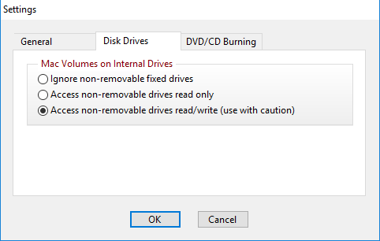
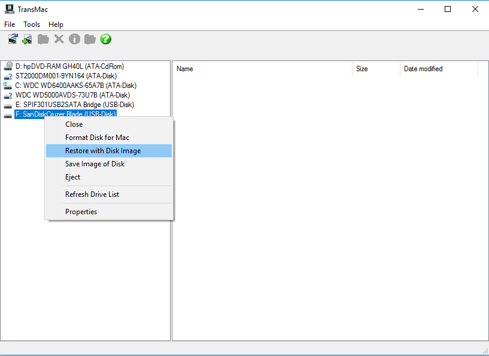

# 製作安裝碟


[https://forum.amd-osx.com/viewtopic.php?f=24&t=1213](https://forum.amd-osx.com/viewtopic.php?f=24&t=1213)


首先，在我們老戰友 Windows 身上安裝 **Transmac**，接著以系統管理員身分打開

打開後請到  **Tools &gt; Settings**，並將設定改為 **Access non-removable drives read/write \(use with caution\)**

接著找到你的隨身碟，右鍵並選擇 **Restore With Disk Image**


隨身碟資料請先備份，這邊會直接清空


然後選擇剛剛下載的 DMG 檔案，接著就可以開始等待製作完成啦，過程有慢有快，視隨身碟速度不定

