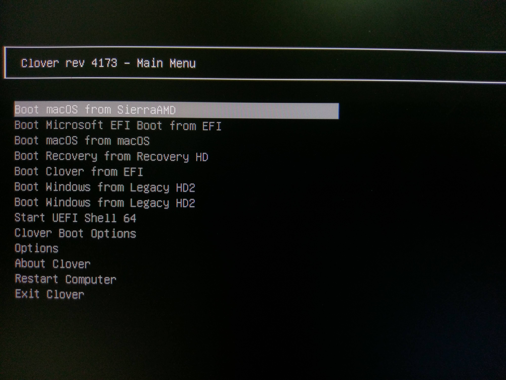
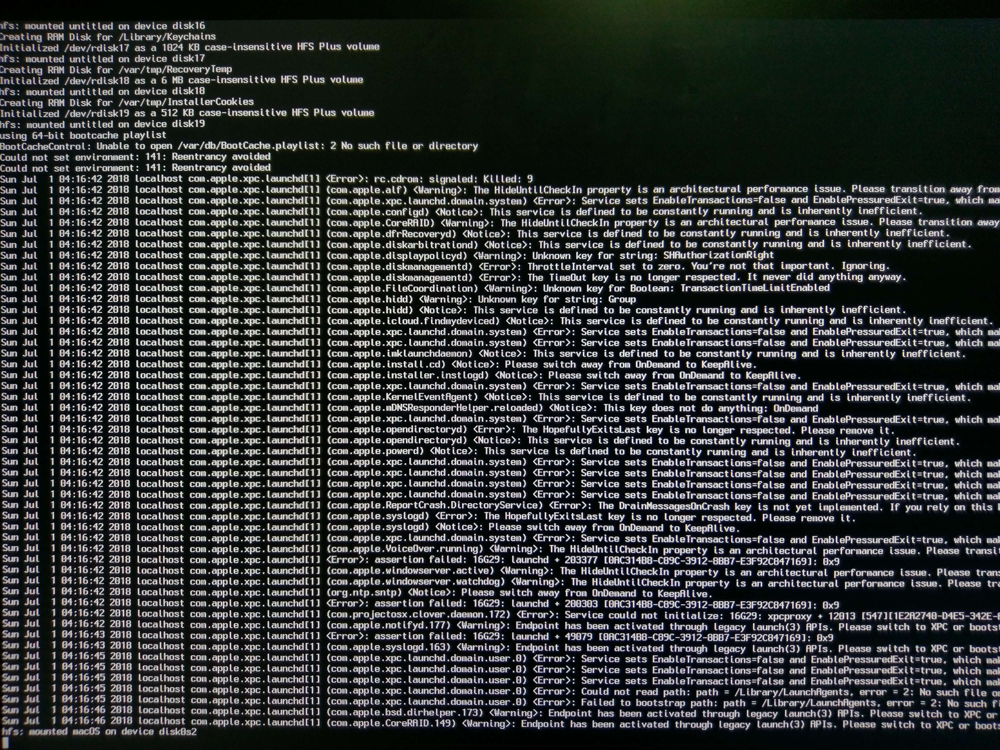
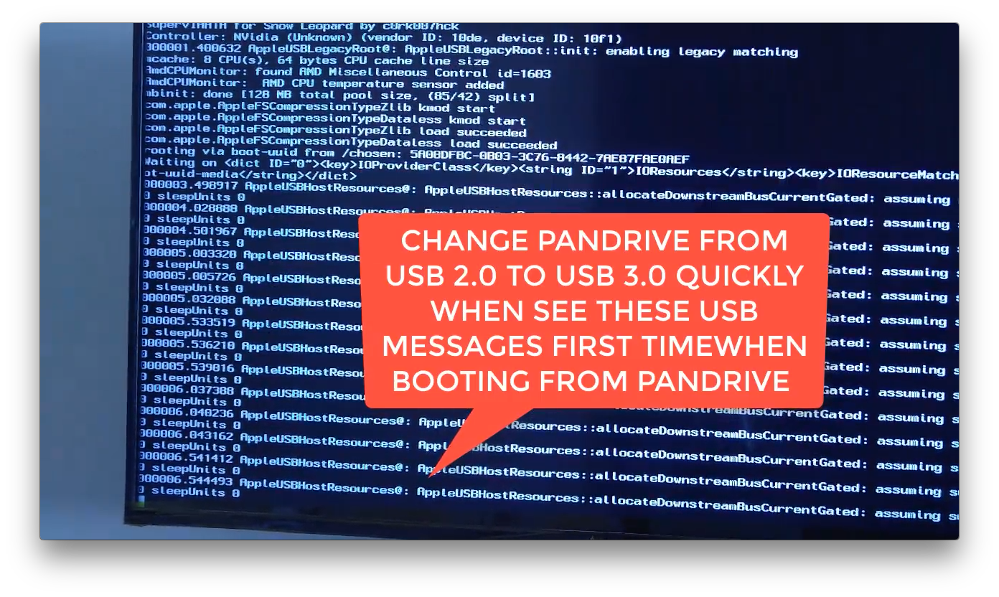
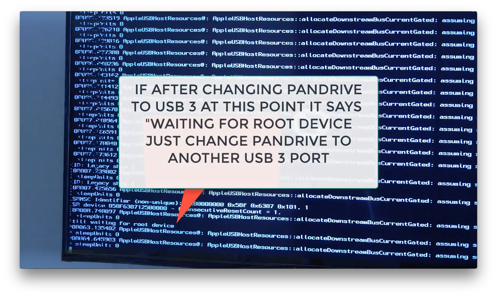
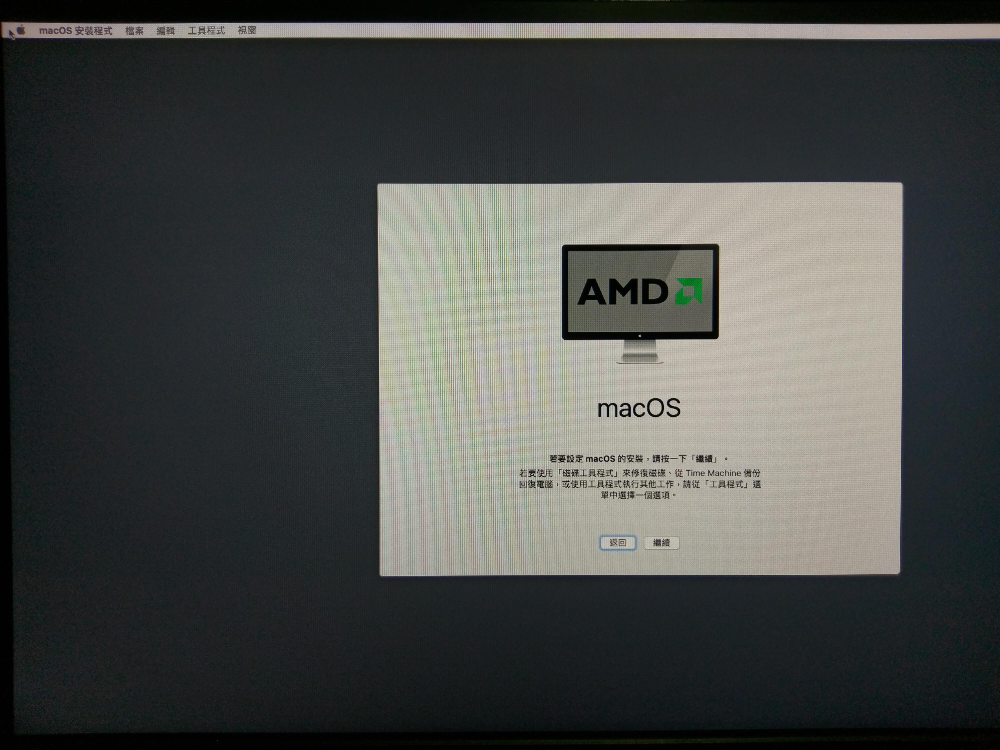
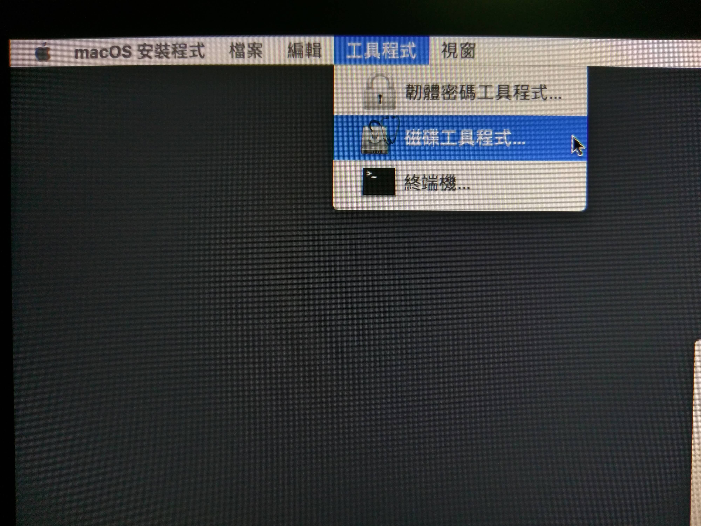
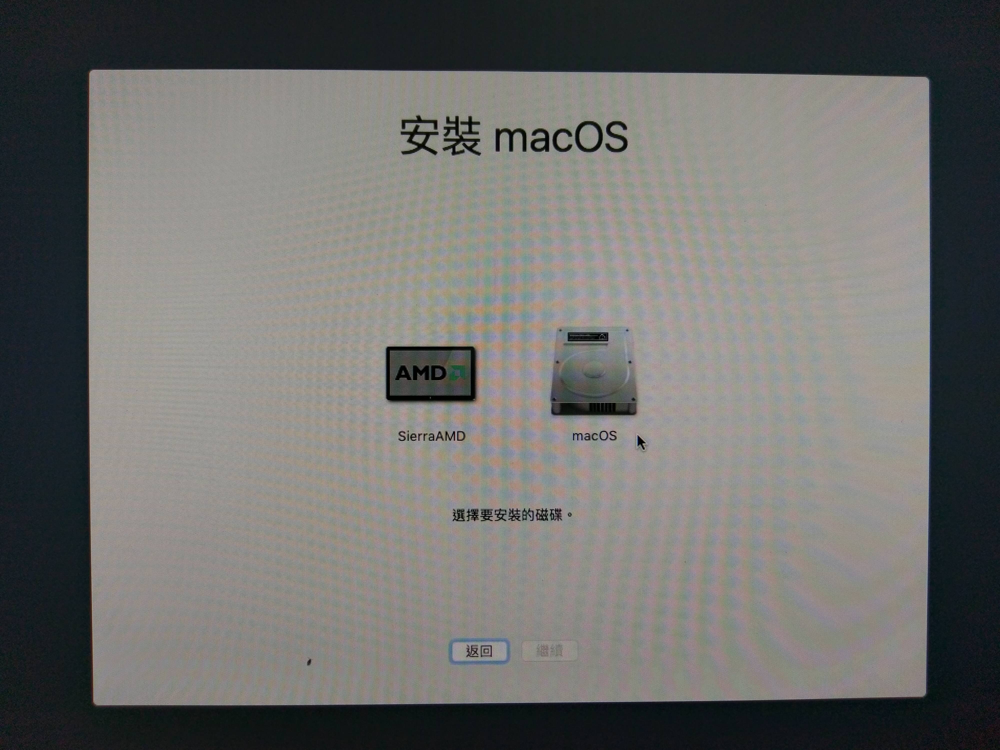

# 開始安裝


[https://forum.amd-osx.com/viewtopic.php?f=24&t=2707](https://forum.amd-osx.com/viewtopic.php?f=24&t=2707)


## 第一次從隨身碟開機

### 開機

隨身碟請插在 USB 2.0 的孔，然後於開機時選擇開機順序，並選擇前方帶有 **UEFI:** 的選項

接著會載入隨身碟內的引導程序，這時候選擇 **Boot macOS from SierraAMD** 並按下Enter

接著會跑一串黑底白字過去，別擔心，正常

**根據另一教學影片**，插在2.0上時，若跑出USB訊息時，快速將隨身碟換到 3.0 的孔上

更換後若出現 Waiting for root device，就在換一孔

接著只要看到著個畫面，安裝成功機率就高達87%了

### 格式化

別急，先不要按安裝，我們要先格式化，選擇 **Utilities &gt; Disk Utility**

磁碟工具程式開啟後，選擇你要安裝的目標磁區，**重新命名**並**格式化為HFS+**


名稱最好不要有空格，不然會增加麻煩，建議簡單名稱即可，例如：**macOS**


完成後關閉磁碟工具程式回到安裝畫面

### 開始安裝

緊接著就可以開始安裝啦，筆者自己的安裝過程約為40分鐘，所以不用急

> 如果你很閒的話可以快速晃滑鼠，鼠標會變大

下一步並同意條款後，選擇目標硬碟，也就是剛剛格式化的硬碟

然後就可以開始邁向蘋果啦，安裝完成後重開機繼續下一步吧!

題外話：後來進系統後裝驅動時裝壞了又導致不能開機，然後加上試裝成功後加購 SSD 並正式安裝，前前後後共安裝了 10 餘次。

