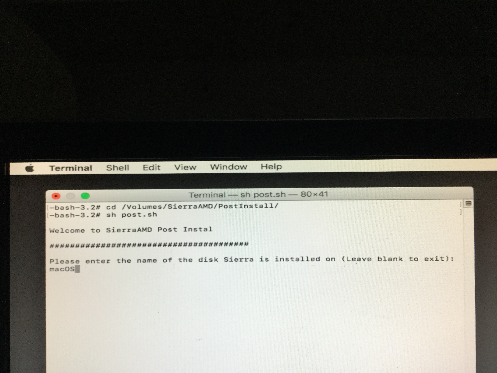

# Post Install

再次**從隨身碟**開機並選擇 **Boot macOS from SierraAMD**，我們要更換內核

再次進入安裝畫面後從上方選擇 **Utilities &gt; Treminal**，我們要輸入一點點的指令

 `sh /Volumes/SierraAMD/PostInstall/post.sh` 

然後輸入剛剛安裝的目標硬碟名稱，例如：macOS

輸入完後按 Enter，會自動跑更換程序，最後出現 **Enjoy Your System** 就成功了，接著看要手動重開機或等它自動重開機都可以

