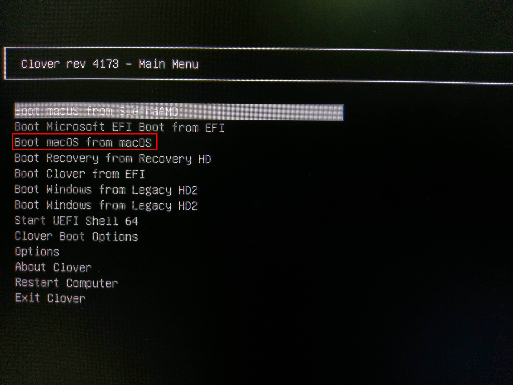
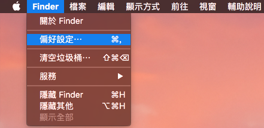
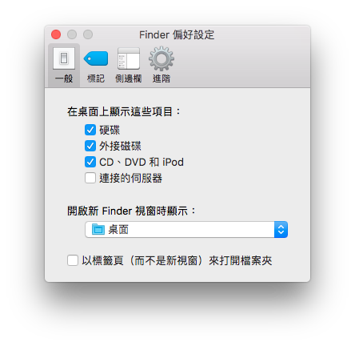
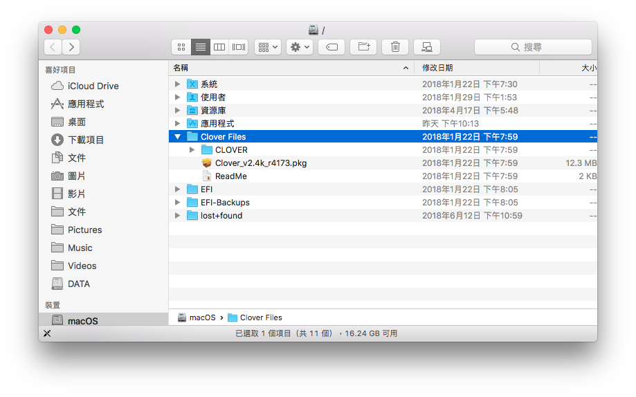
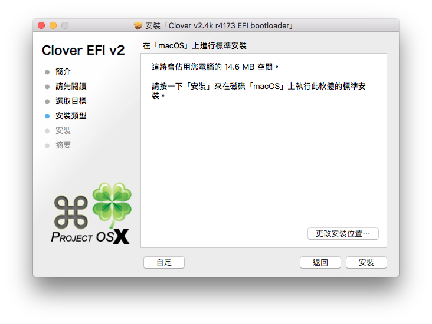
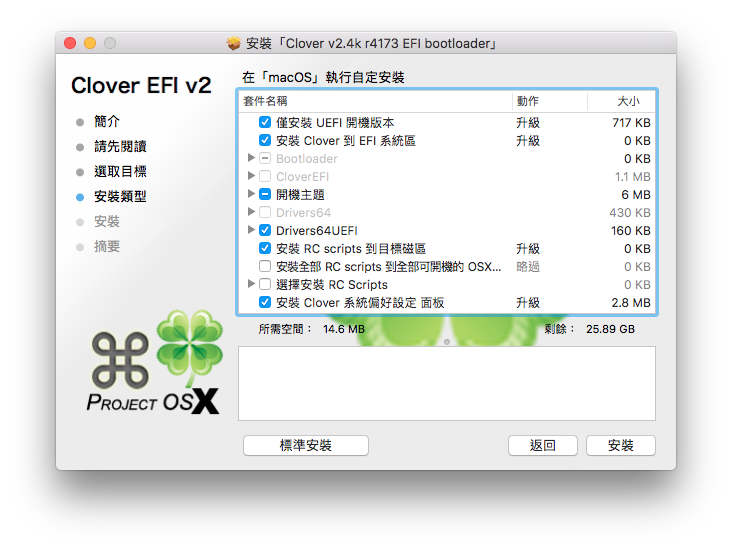
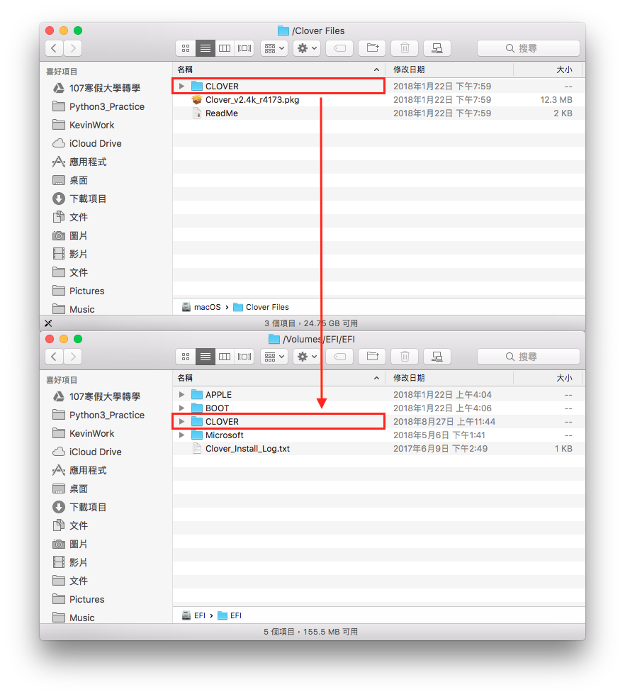
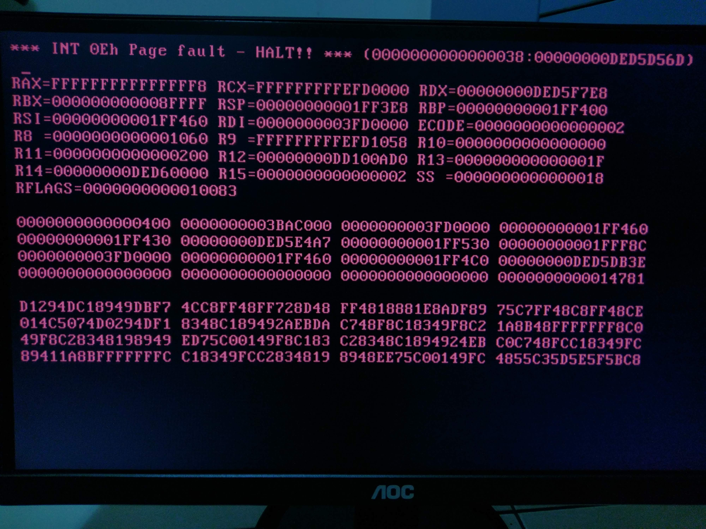

# Clover 引導

等等！隨身碟還不要拔！我們還需要它進行最後一次的引導！

再次從隨身碟開機，不過這次選擇的是 **Boot macOS from \[硬碟名稱\]**

> \[硬碟名稱\] 是自己取的，筆者的是 macOS，所以就選擇 Boot macOS from macOS

第一次開機會比較久一點點，請耐心等候並期待，當你看到多國語言跑著歡迎字幕時，恭喜你

接下來的初始設定就不贅述了，請依照個人喜好設定，不過傳送分析資料給Apple那類的請不要勾選

## Finder 設定

當看到桌面時 ~~你會很興奮~~ 請先打開 **Finder** 設定

  
勾選

* 硬碟
* 外接磁碟
* CD、DVD 和 iPod

## 安裝 Clover


以下教學為直接翻譯版，我的裝法略有不同


Clover檔案位於系統碟 \(對，幫你放好好\)

右鍵開啟 **Clover\_v2.4k\_r4173.pkg**，並下一步直到安裝類型選擇自訂

接著勾選下列選項，並按安裝

## 複製 Clover 資料

安裝完成後，需要把資料複製到 EFI 磁區

開啟 Clover configurate 並掛載 EFI 磁區

接著到 macOS 所在的磁碟並進入 `/Clover Files` 資料夾，將 `CLOVER` 資料夾複製到 EFI 磁區中的 EFI 資料夾覆蓋 `CLOVER` 資料夾

接下來進到剛剛複製後的 Clover 資料夾中，將 `config_RX480.plist` 重新命名為 `config.plist` ，至於原本的就看要備份或者刪除都可以。

重開機，接下面

## 更換開機順序 \(極度重要\)

拔了隨身碟，結果不能開機，怎麼開都是黑底紅字寫著神奇的字串

很多人卡在這一步，就因為沒有將開機順序更換為硬碟開機，更換後就可以拔隨身碟靠自身力量開機啦！

如下圖，將有 Clover 的開機順序換至第一順位

如果你順序沒換...

##  關於我的 Clover

~~當時我怎麼裝就是不能開機，也不知道是怎樣，所以最後爬文找到了一位用 Asrock 主機板的 Youtuber 所分享出來的 EFI 資料夾，然後放進去就可以開機了...~~

~~當然後續我有做了一些設定，拿掉了一堆 Boot Arguments、改了 SMBIOS 等~~

重裝時，我照著此文的方法做，確實可行。

