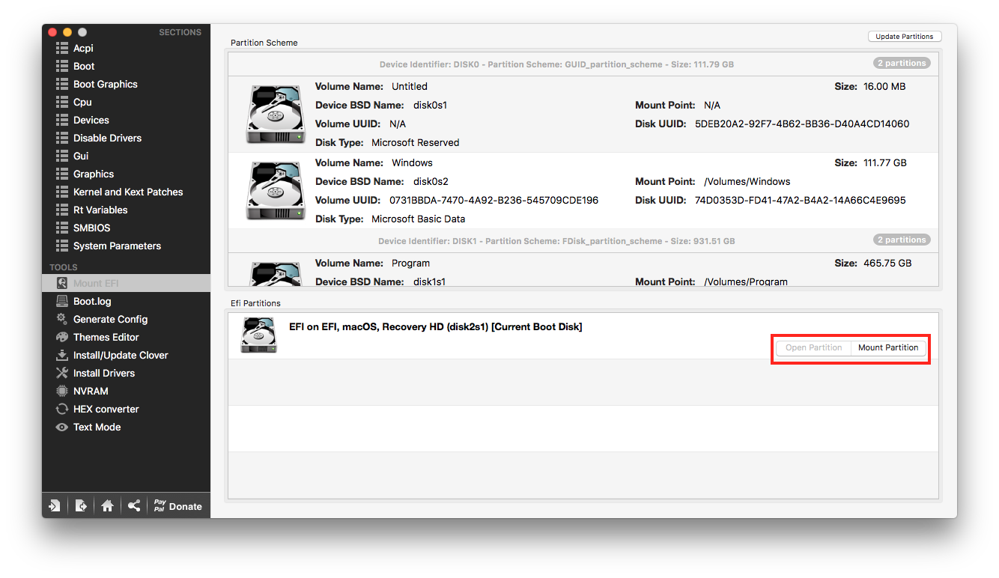
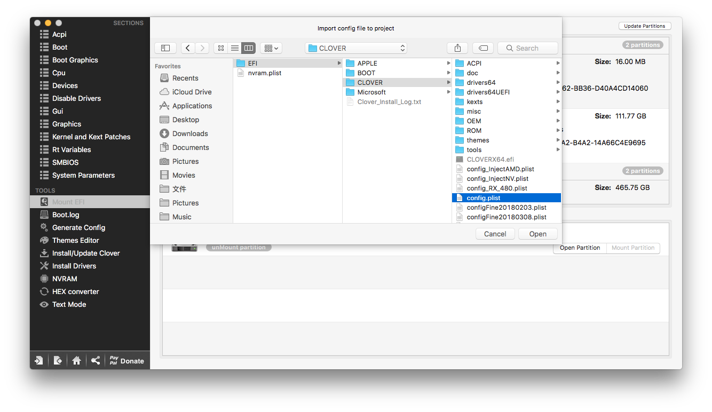

# Clover Configurator


下載：[https://mackie100projects.altervista.org/download-clover-configurator/](https://mackie100projects.altervista.org/download-clover-configurator/)


一個用來修改開機配置的小工具，沒有他不會怎樣，但有了它會變神

## 使用方式

第一步，也是每次都必做的一步，掛載EFI分區

打開後選擇 **Mount EFI &gt; Mount Partition**

然後從左上方選擇 **File &gt; Open**

檔案位於 **EFI &gt; CLOVER &gt; config.plist**

