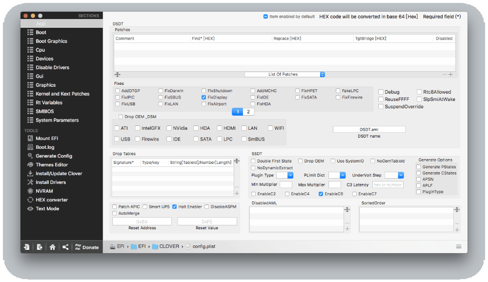
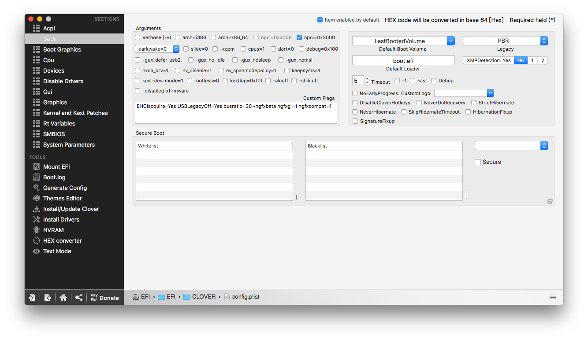
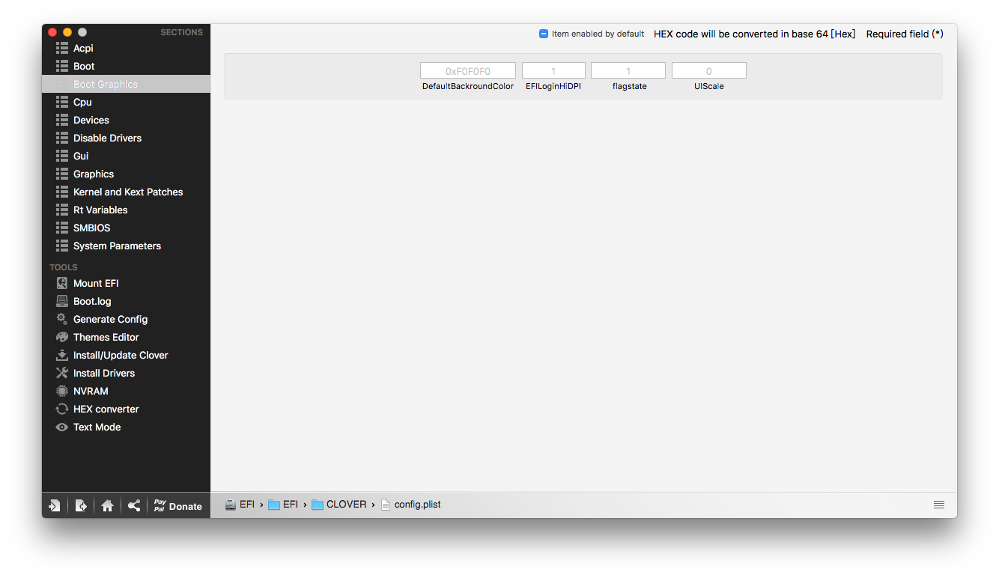
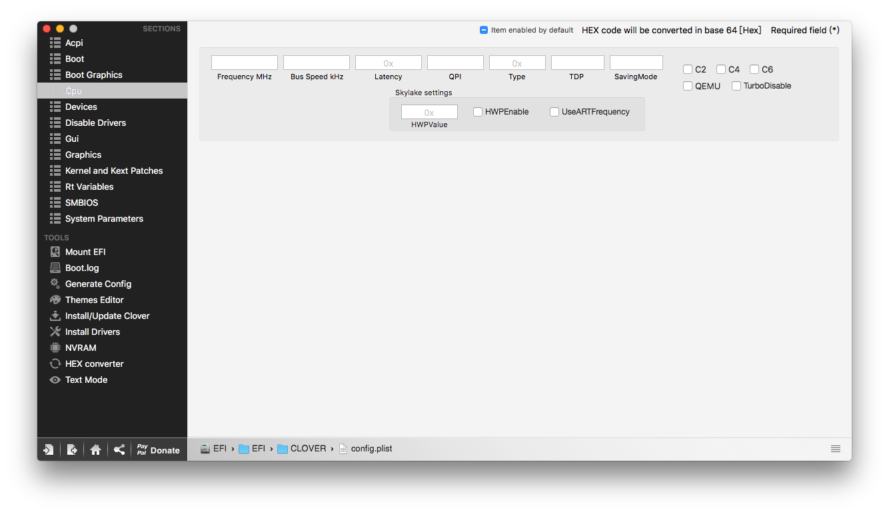
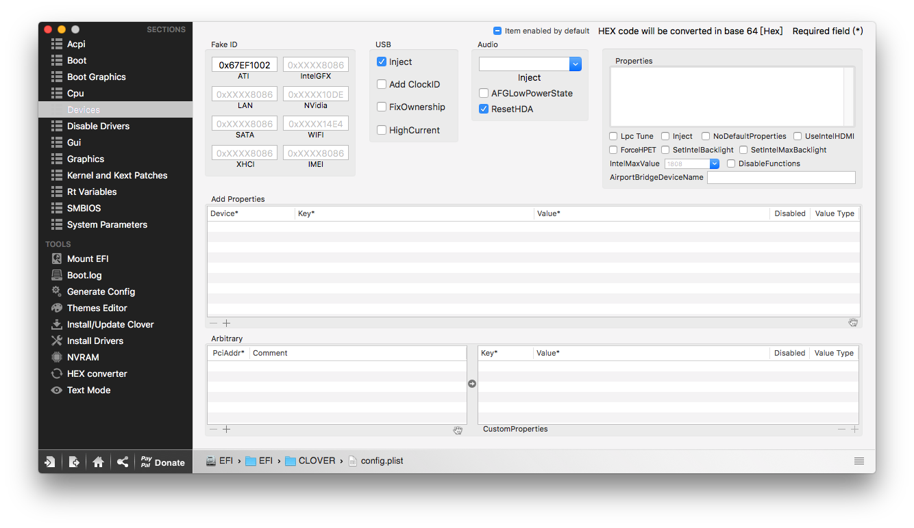
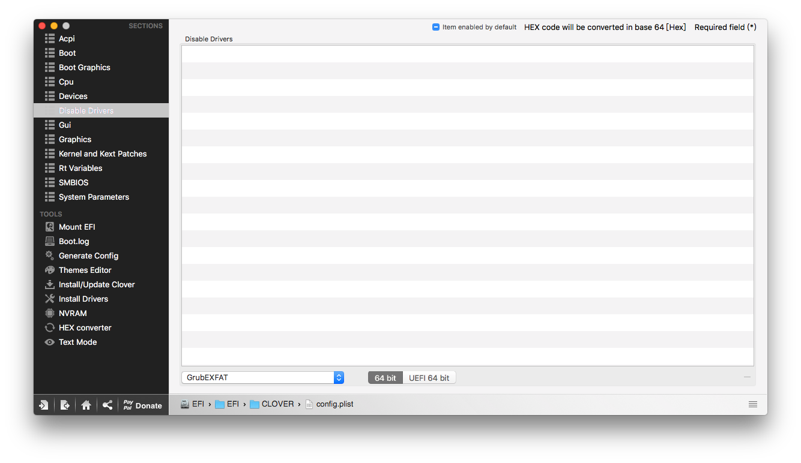
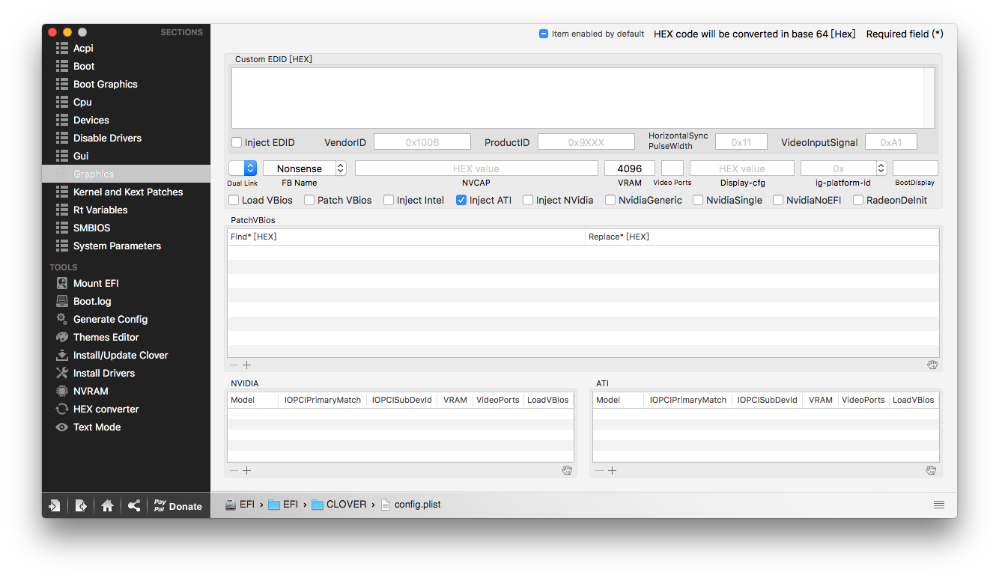
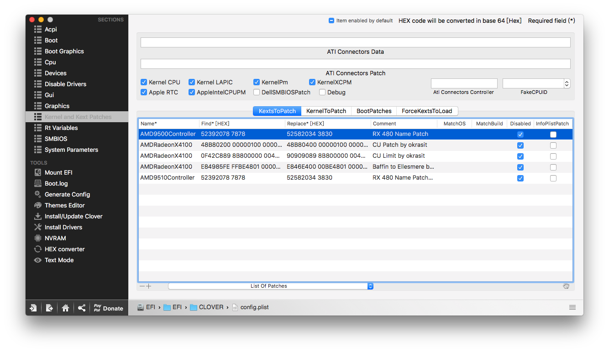
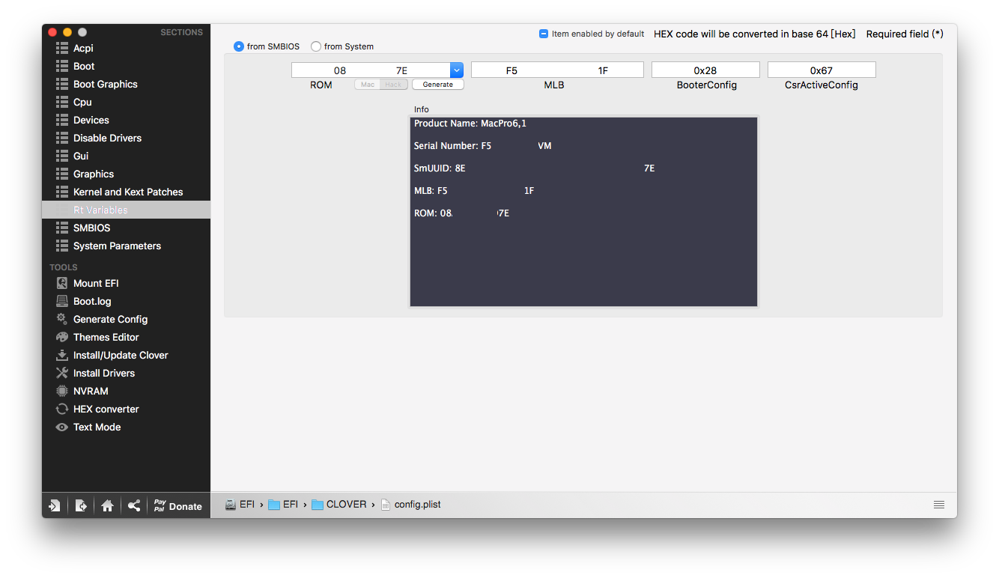
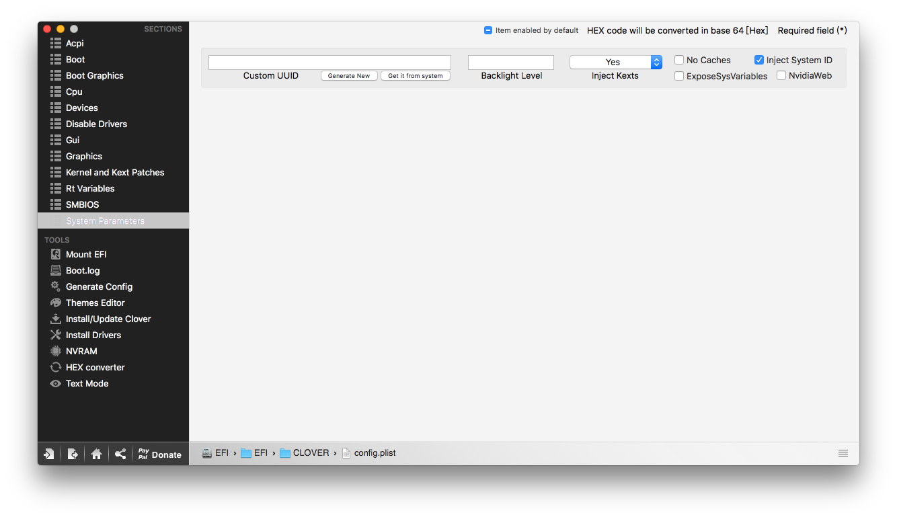

# Clover  配置分享

等所有 Kexts 裝完之後，記得回來這邊把慢慢的把勾勾取消掉，一個一個慢慢嘗試，每處理一次就重開機一次，當然，每次處理前請先備份前次可以正常開機的 config 檔案。

以下就是我的 Clover 配置，僅供參考：

### ACPI

### BOOT

### Boot Graphics

### CPU

### Devices

### Disable Drivers

### GUI

### Graphics

### Kernel and Kext Patches

### RT Variables

### SMBIOS

### System Parameters

