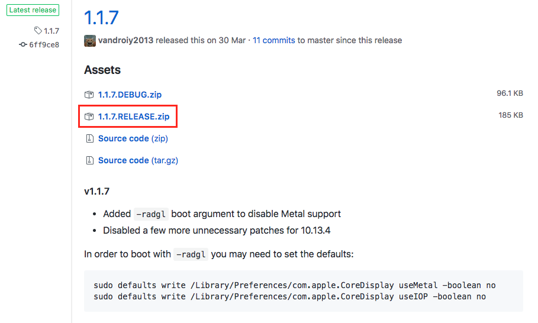
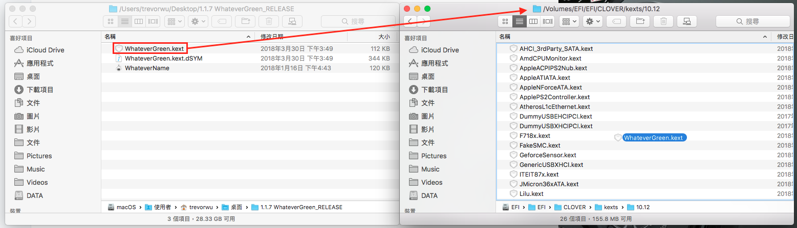

# 顯示 \(AMD\)


WhateverGreen 驅動下載：[https://github.com/vit9696/WhateverGreen/releases](https://github.com/vit9696/WhateverGreen/releases)


## 安裝教學

下載最新的 Release

解壓縮剛剛下載的 1.1.7.Release.zip \(撰寫時最新版\)  
打開 Clover Configurator 並掛載EFI分區

接著將 WhateverGreen.kext 移動到 EFI 分區中的 kext/10.12

好了，就這樣，關機裝卡然後開機，就可以用了，比 Nvidia 簡單太多了

