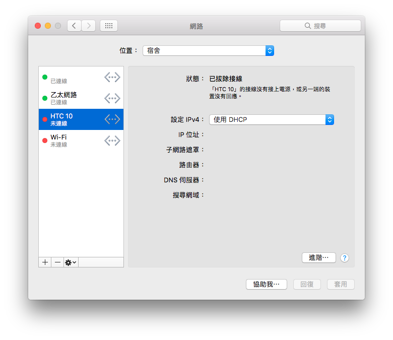

# Android 網路分享


驅動下載：[https://joshuawise.com/horndis](https://joshuawise.com/horndis)


## 安裝教學

### 下載

筆者系統版本為10.12，所以下載最新版的**Release 8**

### 開始安裝

下一步到底然後重開機即可

## 使用

將你的Android手機插上電腦，然後選擇網路分享，就這樣

