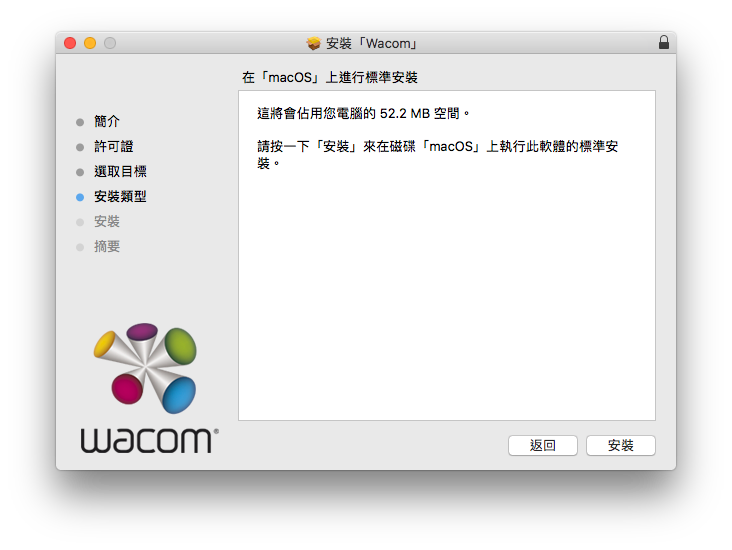
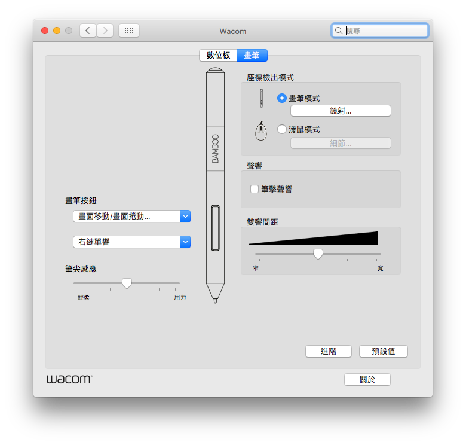

# 繪圖板 CTL-471

## 安裝教學


下載：[https://www.wacom.com/en-us/support/product-support/drivers](https://www.wacom.com/en-us/support/product-support/drivers)


然後打開 PKG 檔就可以安裝了，裝完後不用重開機。

之後可以在**系統偏好設定**看到設定面板出現

