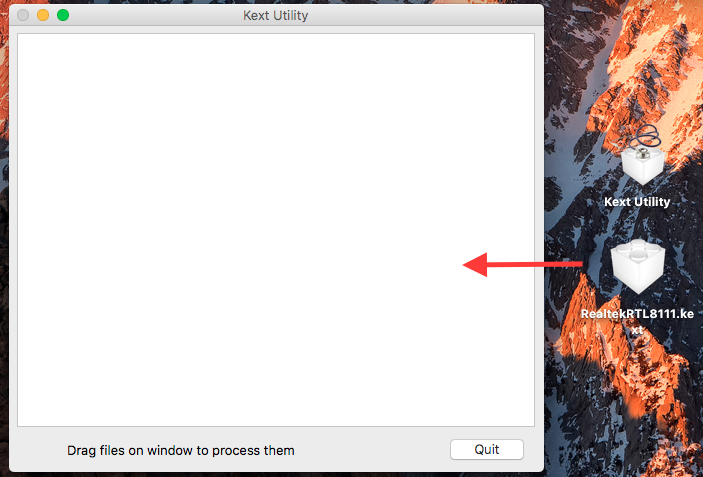

# 網路


RTL8111驅動下載：[https://bitbucket.org/RehabMan/os-x-realtek-network/downloads/](https://bitbucket.org/RehabMan/os-x-realtek-network/downloads/)

驅動說明：[https://bitbucket.org/RehabMan/os-x-realtek-network](https://bitbucket.org/RehabMan/os-x-realtek-network)


## 安裝教學

首先下載 [RehabMan-Realtek-Network-v2-2017-0322.zip](https://bitbucket.org/RehabMan/os-x-realtek-network/downloads/RehabMan-Realtek-Network-v2-2017-0322.zip)

接著進入 `S/L/E` 和 `Clover/kexts/10.12` 資料夾中找到其他網路驅動，並移除，常見的像是 `RealtekRTL81xx.kext` ，反正通通移除就對了。

接著打開 Kext 工具，個人是使用 Kext Utility （可在**實用資源**找到）

等他自己跑完一輪後，把剛剛下載的檔案解壓然後拖進去這個視窗，在等他跑完一輪

重開機後就可以享用網路啦！

