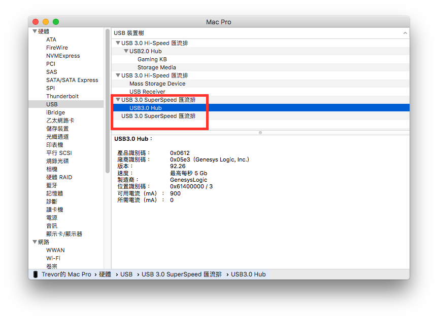

# USB


USB驅動下載：[https://bitbucket.org/RehabMan/os-x-generic-usb3/downloads/](https://bitbucket.org/RehabMan/os-x-generic-usb3/downloads/)


## 安裝教學

* DummyUSBEHCIPCI
* DummyUSBXHCIPCI
* GenericUSBXHCI.kext \(Generic USB3\)

將以上東西丟進去 `EFI/Clover/kexts/10.12`

然後找一隻 3.1 Gen 1 的隨身碟或者 Hub 插進去測試，打開 `關於這台Mac > 系統報告 > USB`，USB 3.0 SuperSpeed 有東西就是成功了

## 已知問題 

主機板後方 USB 3.1 Gen 2 無法運作，其餘 USB 3.1 Gen 1 運作正常、速度正常。

