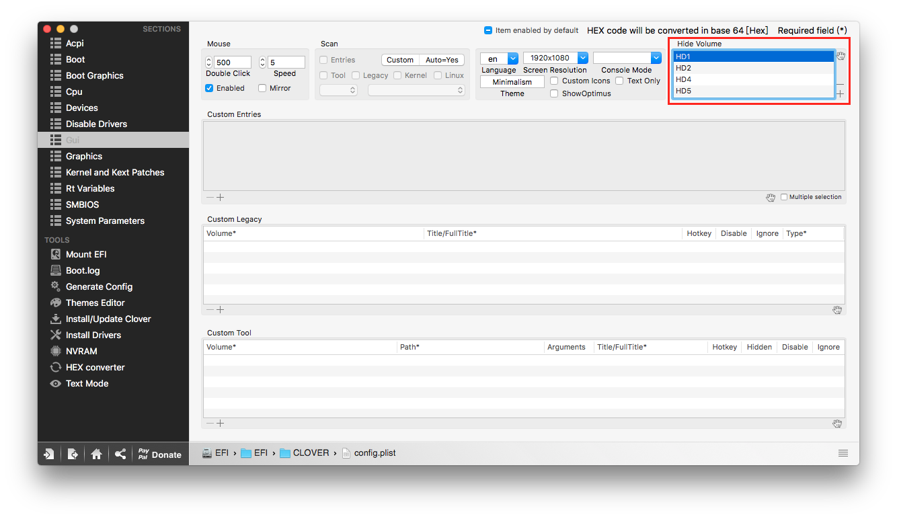

# 關於雙系統


個人建議，如果你有兩台電腦，那麼黑蘋果這台就別裝 Windows 了，不然怎麼死的都不知道


兩種方法

1. Boot Camp
2. 直接裝

我個人採用第二種方法，直接裝！

安裝前拔除所有硬碟，留下要安裝 Windows 的硬碟

照 Windows程序走， 安裝完成後將所有硬碟插回，並至 Bios 將開機順序改為使用 Clover 開機，Clover 會自動抓取可開機磁區，這時候剛剛裝好的 Windows 會顯示出來，不過 Clover 會抓到非常多磁區，可依照個人狀況將其他磁區隱藏

Boot Windows from \[磁區代號\]，於 Clover Configurator 輸入這個代號就對了

