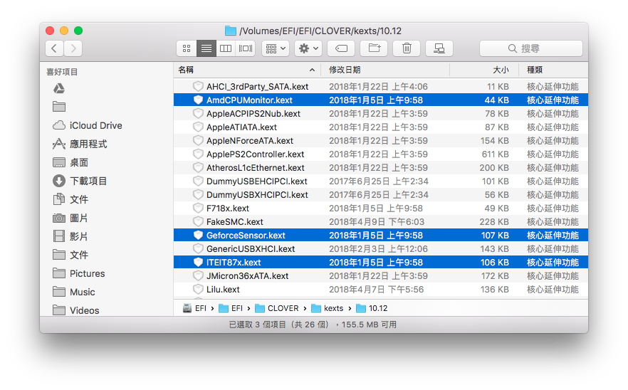
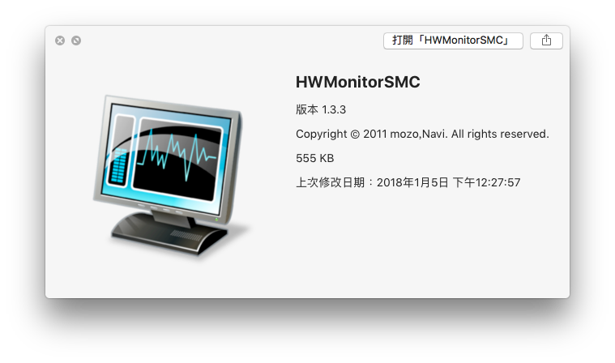
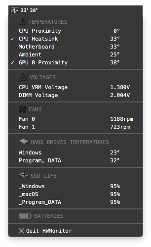
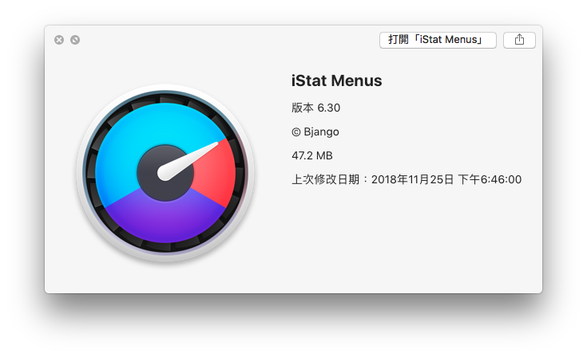
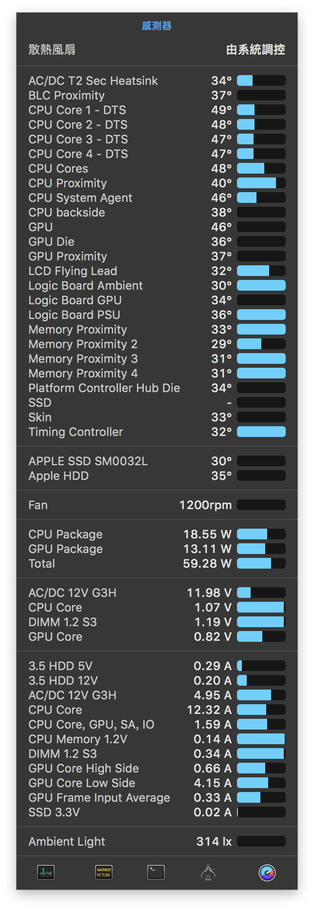
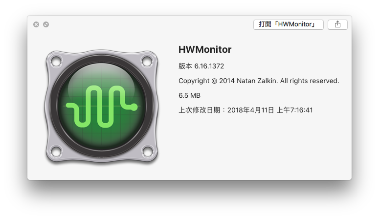
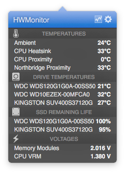

# 關於監控硬體

監控硬體，我想這是很多玩家會做的事，而且牛牽到北京還是牛，就算移到 macOs 上還是會想盡辦法來監控硬體

因為是 Ryzen ，所以在監控軟體的溫度這項是不管用的，需要一些 kexts 才能看到，而且還不是很完整

##  安裝 Kext


[https://hackintosher.com/forums/thread/amd-hackintosh-hwmonitor-temperatue-sensor-monitoring-instructions.78/](https://hackintosher.com/forums/thread/amd-hackintosh-hwmonitor-temperatue-sensor-monitoring-instructions.78/)


檔案說明 \(擷取自原網站\)：  
FakeSMC.kext - 任何黑蘋果的必須檔  
**AmdCPUMonitor.kext** -  AMD CPU 專用的溫度監控  
  
**ITEIT87x.kext** - 給 ITE LPC 晶片，用於大部分技嘉主機板或較新的華碩主機板  
W836x.kext - 給 Winbond 或 Nuvoton NCT LPC 晶片，通常用於華碩主機板  
F718x.kext - 給 Fintek 晶片  
  
**GeforceSensor.kext** - 較新的 nVidia 顯卡用 \(4xx, 5xx, .... 10xx series\)  
NVClockX.kext - 較舊的 nVidia 顯卡用 \(7xxx-9xxx series\)  
RadeonMonitor.kext - 給 Radeon 的卡用 \(HD4xxx+ - 8xxx, R7 4xx 5xx series\)  
  
HWMonitorSMC.app - 監控軟體  
iStat pro.wdgt - 監控小工具

我個人只有把其中的 `AmdCPUMonitor.kext`、`ITEIT87x.kext`、`GeforceSensor.kext` 放入 EFI 磁區的 kexts 資料夾

## 監控軟體

### HWMonitorSMC

`內附的，我也不知道是付費還是免費`

  
此軟體主要會顯示在最上面那一排，然後可以按一下看到完整資訊這樣

### iStat Menus

`付費`


[https://bjango.com/mac/istatmenus/](https://bjango.com/mac/istatmenus/)


監視狂的最愛，各種你想得到的、你想不到的，他通通都包含

真正的 Mac 可以看到一排感測器（示範機型 iMac 5K, 2017）：

### HWMonitor

也是從上面那一排出現的，不過看起來比較簡陋

## 

