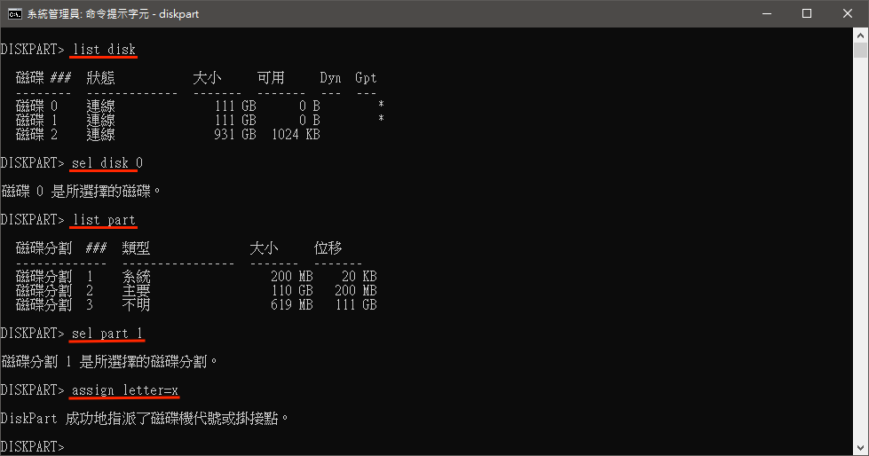

# 關於不透過macOS修改EFI磁區

弄驅動時常常會碰 EFI 分區，然後有一次又弄到不能開機，以往我都會直接重裝，但這次幾乎已經裝好了，不想放手，基於這個賭爛的原因，直接怒裝 Windows 來改 EFI 分區。

首先開啟不想再碰的 Windows，並以管理員身份開啟命令提示字元

輸入 `diskpart` 開啟磁碟工具

輸入 `list disk` 列出所有磁碟

輸入 `sel disk 0` 選擇安裝黑蘋果的磁碟（磁碟編號因人而異）

輸入 `list part` 列出磁碟上所有分區

輸入 `sel part 1` 選擇 EFI 分區

輸入 `assign letter=x` 將剛剛選中的磁區掛載為編號 `X`的硬碟

可是你會發現沒有權限進入，這時我們就需要**系統管理員**的身份強迫進入這個磁區

在開始選單中找到記事本並以**系統管理員**身份開啟，然後選擇文件 &gt; 開啟舊檔，接著就可以選到剛剛掛載不能看的磁區一探究竟囉

接下來就是把剛剛讓我們不能開機的 kext 拿掉，然後繼續試下一個 kext ...

