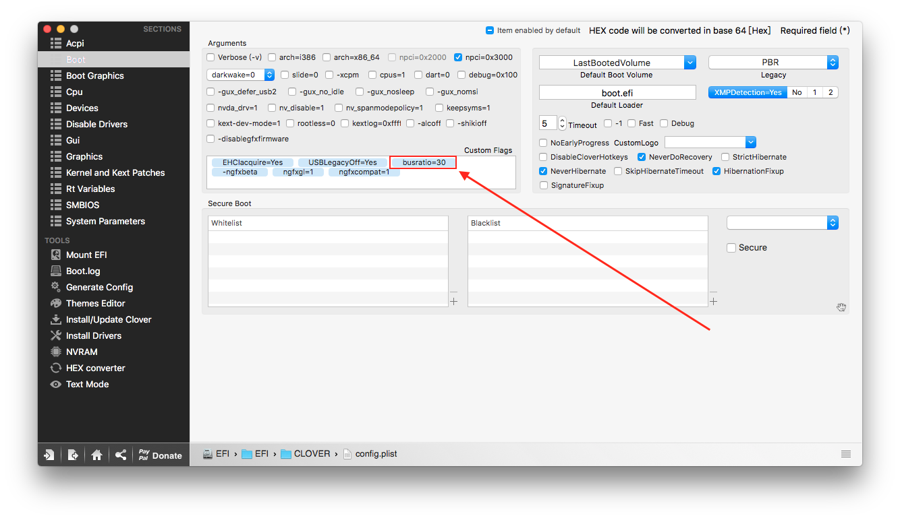

# 關於 Ryzen 性能損失

好多好多人在說Ryzen會有性能損失，我沒測試，反正我是信了

## 解決辦法

打開Clover Configurator &gt; Boot，並加入Flags

以下抄來的，不管爬哪一個教學都寫得一模一樣，我就致意一下直接抄過來啦

> **總線** **速率**由以下公式計算：**CPU速度時鐘（MHz）/總線速度（MHz）=總線速率。**
>
> CPU速度時鐘（MHz）= **CPU速度（GHz）x 1000**
>
> 所有Ryzen CPU的總線速度（Mhz）= **100MHz**
>
> **例子：**
>
> * Ryzen 1800X 3.6GHz; **busratio = 36**
> * Ryzen 1700x 3.4GHz; **busratio = 34**
> * Ryzen 1700 3.0GHz; **busratio = 30**
> * Ryzen 1600X 3.6GHz; **busratio = 36**
> * Ryzen 1600 3.2GHz; **busratio = 32**
> * Ryzen 1500X 3.5GHz; **busratio = 35**
> * Ryzen 1400 3.2GHz; **busratio = 32**

筆者使用 Ryzen 7 1700，所以加入**busratio = 30**

