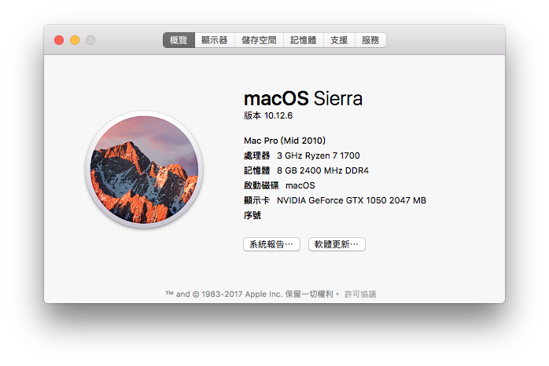
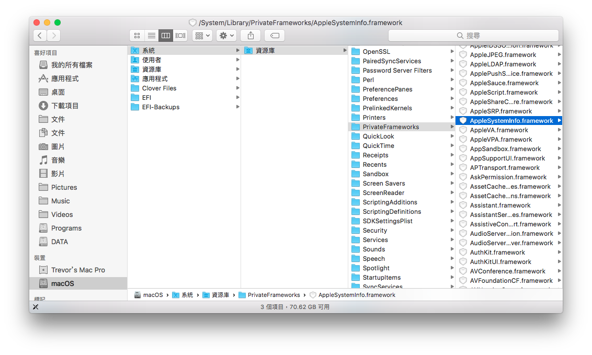
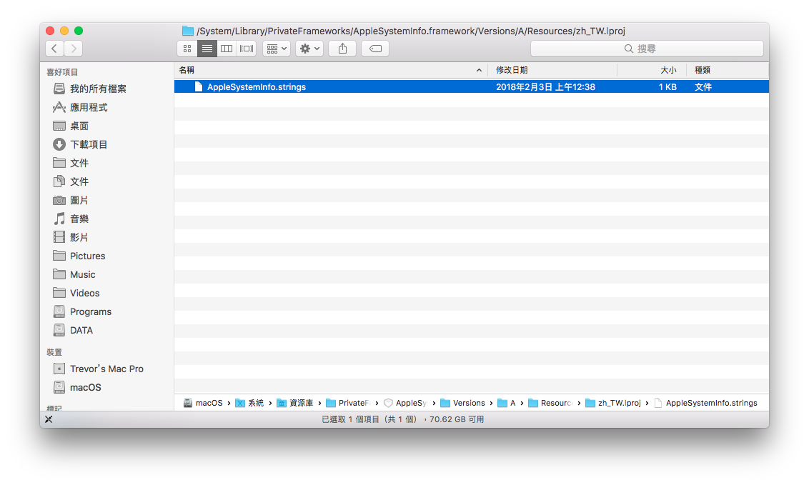
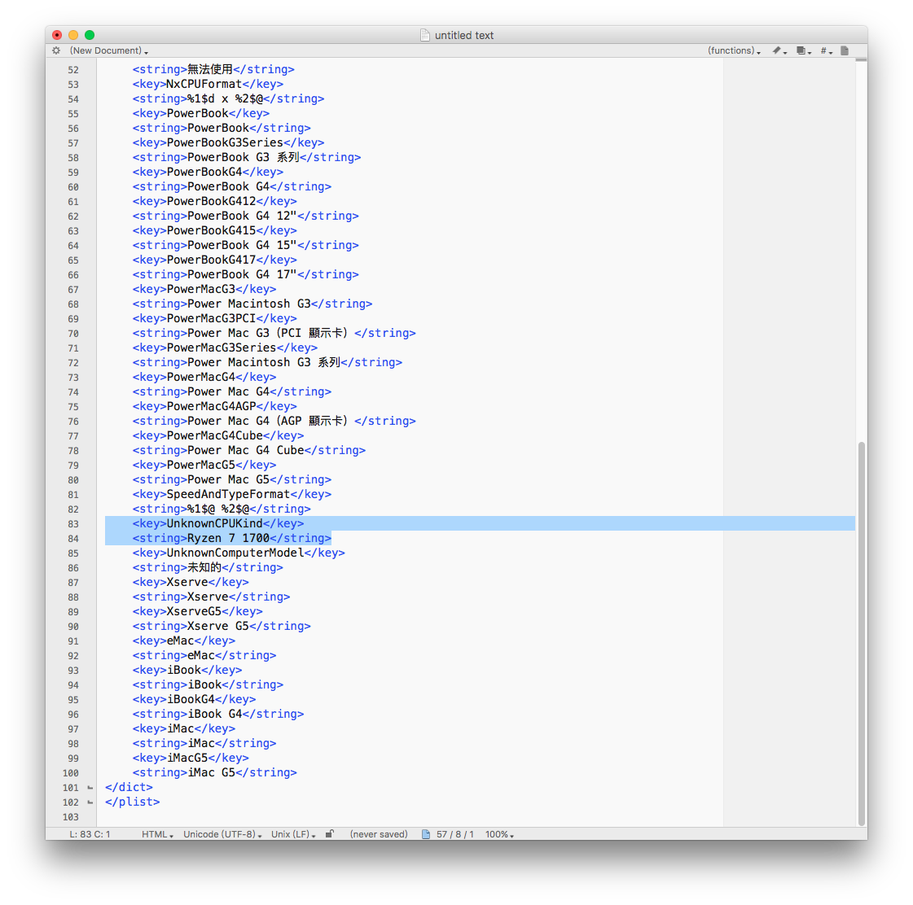

# 關於這台Mac

先上完工圖

##  修改教學

### 處理器

在Finder中前往 **/System/Library/PrivateFrameworks**，  
並找到**AppleSystemInfo.framework**

在 **AppleSystemInfo.framework** 底下前往 **/Versions/A/Resources/zh\_TW.lproj，**  
並找到 **AppleSystemInfo.strings**

使用 [TextWrangler](https://itunes.apple.com/tw/app/textwrangler/id404010395?mt=12) 開啟 **\(記得備份\)** 

找到以下區塊，並替換**未知的。** 例如：Ryzen 7 1700

`<key>UnknownCPUKind</key>  
<string>未知的</string>`

要復原，將原始檔覆蓋即可。

完整路徑`/System/Library/PrivateFrameworks/AppleSystemInfo.framework/  
Versions/A/Resources/YOUR_SYSTEM_LANGUAGE.lproj/AppleSystemInfo.strings`

### 顯示器圖片

完整路徑

`/System/Library/CoreServices/CoreTypes.bundle/  
Contents/Resources/public.generic-lcd.icns`

### 機型和年份

完整路徑

`/Users/使用者名稱/Library/Preferences/com.apple.SystemProfiler.plist`

### 系統圖示

完整路徑

`/Applications/Utilities/System Information.app/  
Contents/Resources/SystemLogo.tiff`

