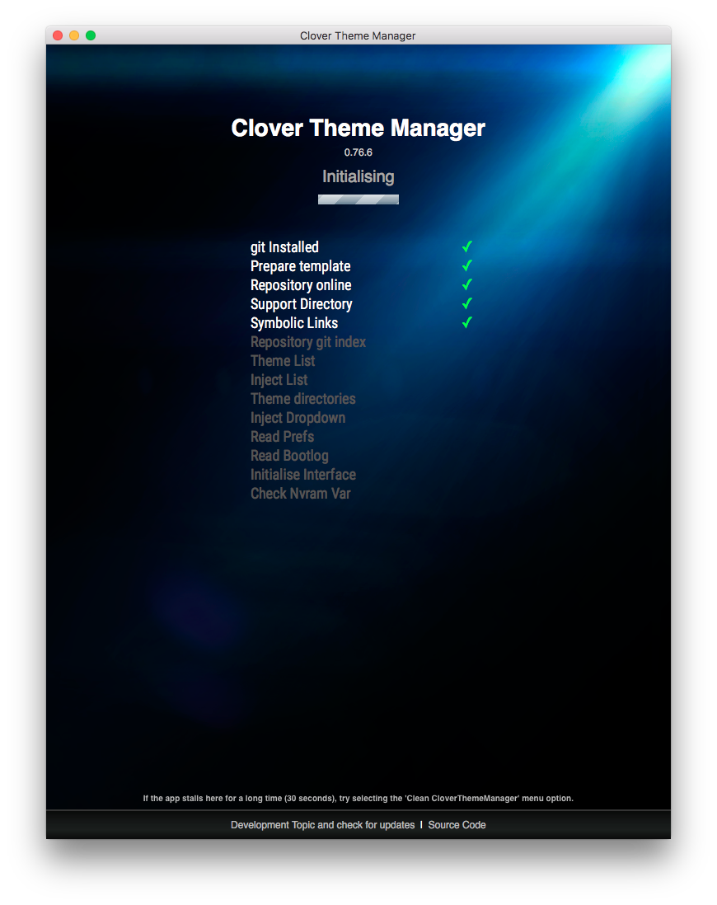
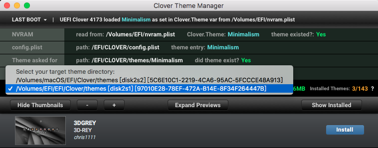
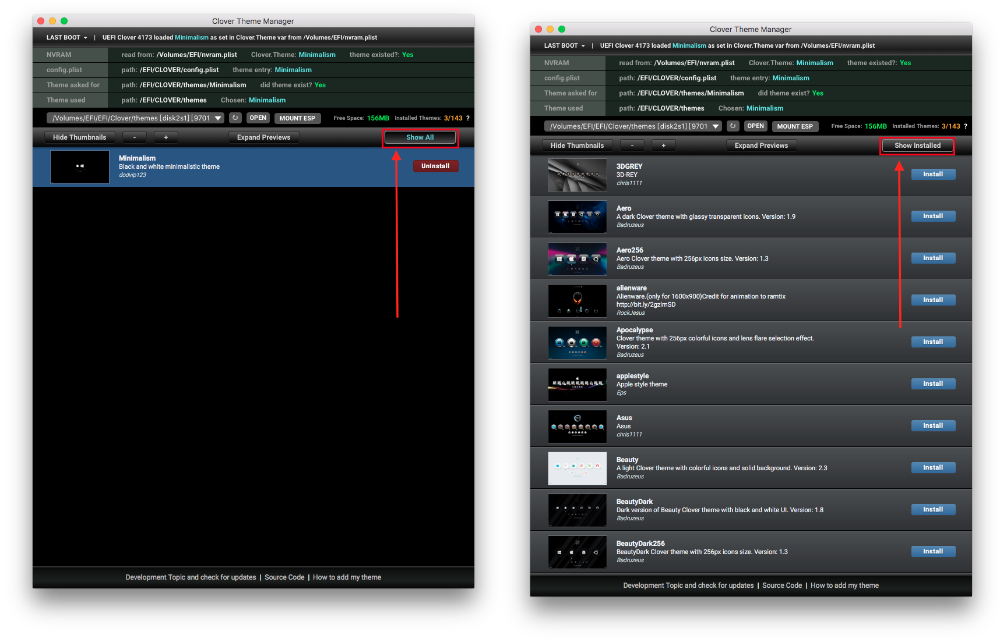
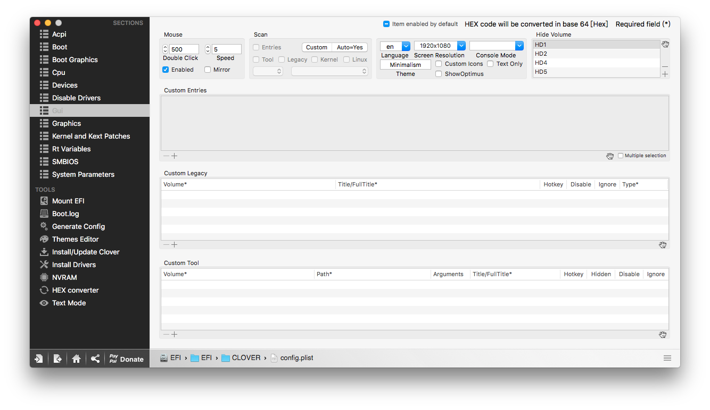
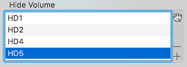

# 關於開機選單的佈景


Clover Theme Manager下載：

[https://www.insanelymac.com/forum/topic/302674-clover-theme-manager/](https://www.insanelymac.com/forum/topic/302674-clover-theme-manager/)


## 安裝教學

首先，開啟 Clover Configurator，並掛載 EFI 磁區

接著，將下載完的 Clover Theme Manager 放入 Finder 側邊的 `應用程式`

程式開啟時會確認 git 是否已安裝，若無會提示要求安裝，這時照提示安裝即可

順利的話會看到一排綠色勾勾

進到主畫面後，選擇你的開機磁區（剛剛掛載的 EFI 磁區）

確認`Show All / Show Installed`是選擇在 Show All，不然會沒有任何東西

然後就可以在列表中選一個自己中意的啦！我自己是選擇 Minimalism，簡約好看

選擇好後按下一旁的 **install**，這邊使用 Nightwish 示範

你以為這樣就好了嗎？不不不，我們還需要到 Clover Configurator 更改一些設定

打開 Clover Configurator ，並開啟熟悉的 config.plist 檔案，接著導航到一旁的 GUI 頁籤

接著在 **Theme** 的地方打上剛剛選擇的主題名稱，例如：**Nightwish**

除此之外，**Screen Resolution** 請選擇自己的螢幕解析度，以獲得最佳體驗

完成後就可以儲存重開機看結果囉！

## 疑難雜症

### 開機畫面怎麼會有一大堆磁區

這通常是因為硬碟很多造成的，我本身有三顆硬碟，然後 Clover 笨笨的，全部抓來讓你選，可是實際上有用處的只有用來開Windows的 `Windows Boot Manager` 和 用來開 Hackintosh 的 `Clover`，這時候就需要一個一個慢慢嘗試，把不能用來開機的磁區隱藏起來

如何知道磁區名稱呢？在開機畫面會寫 Boot Windows from **HD2**

這個 HD2 就是要輸入 Hide Volume 的數值啦

