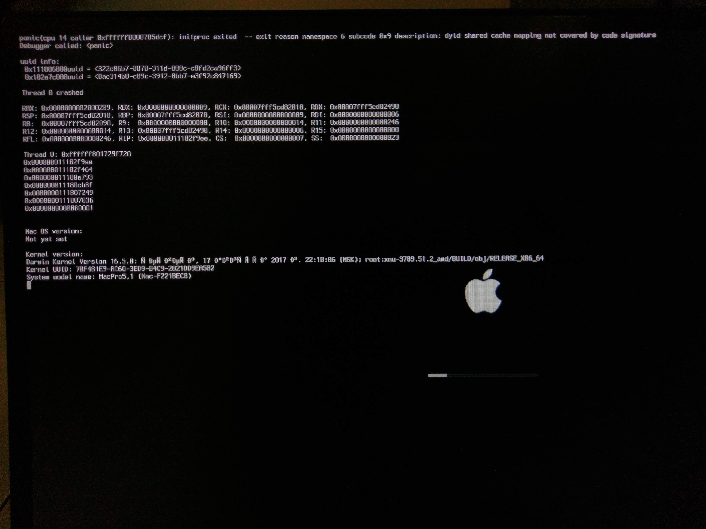

# 更新紀錄

## 更新紀錄

2019/03/10 - 穩定，更新一下做慶祝  
- 更新「關於不透過 macOS 修改EFI磁區」位於「其他」  
- 更新首頁進度文字  
- 分享 Clover 配置  
- 更新了一些 \# \#\#  
- 其他很多東西

2019/03/08 - 簡單來說，Windows 要走帶著 macOS 一起走，大約是寒假開始時的事情了，期間爬文爬到崩潰，今天心甘情願重裝了  
- 新增「Kext 工具」位於「實用資源」  
- 更新「網路」位於「驅動」  
- 更新「讓 Clover 接手開機吧」位於「安裝」  
- 更新「關於開機選單的佈景」位於「其他」

2019/01/17  
- 更新 USB 位 驅動  
- 更新 讓 Clover 接手開機吧 位於「安裝」  
- 更新 Photoshop 選擇字體會崩潰 位於 「疑難雜症」

2018/12/23  
- 新增「關於監控硬體」為於「其他」

2018/11/27  
- 新增此頁  
- 新增「關於讀寫 NTFS 」位於「其他」

2018/11/20   
- 新增內容於「讓 Clover 接手開機吧」  
- 新增「Photoshop 選擇字體時會崩潰」

2018/10/18 - 這本書瀏覽次數破千是真的還是假的  
- 新增兩張開機選單圖片，位於「關於開機選單的佈景」  
- 更改首頁的敘述文字  
- 加更多空格

2018/10/14 - 穩定使用中，尚未遇到新問題  
-  疑難雜症文章重新排序  
-  疑難雜症新增了一篇「睡眠後 USB 機率性失效」  
-  將疑難雜症中的文章格式統一  
-  完成「關於不透過 macOS 修改 EFI 磁區」，位於其他  
-  將我看得到的英文與中文間加上空格

