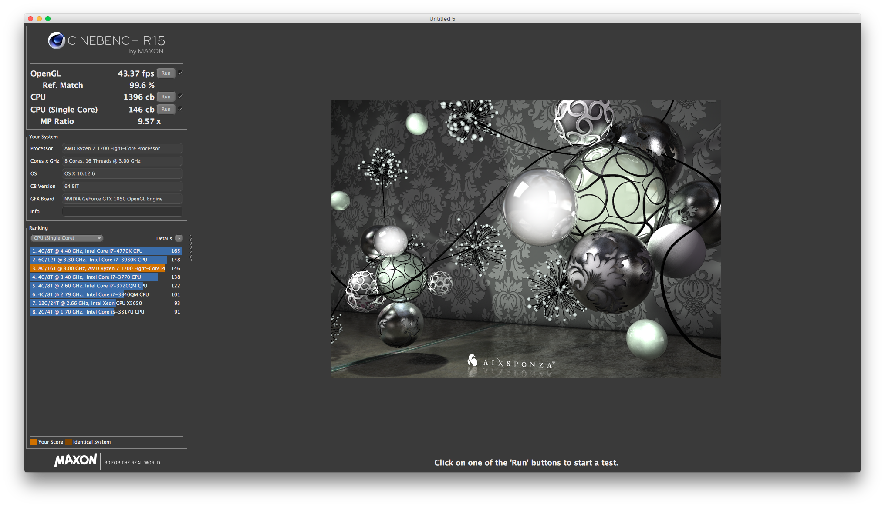
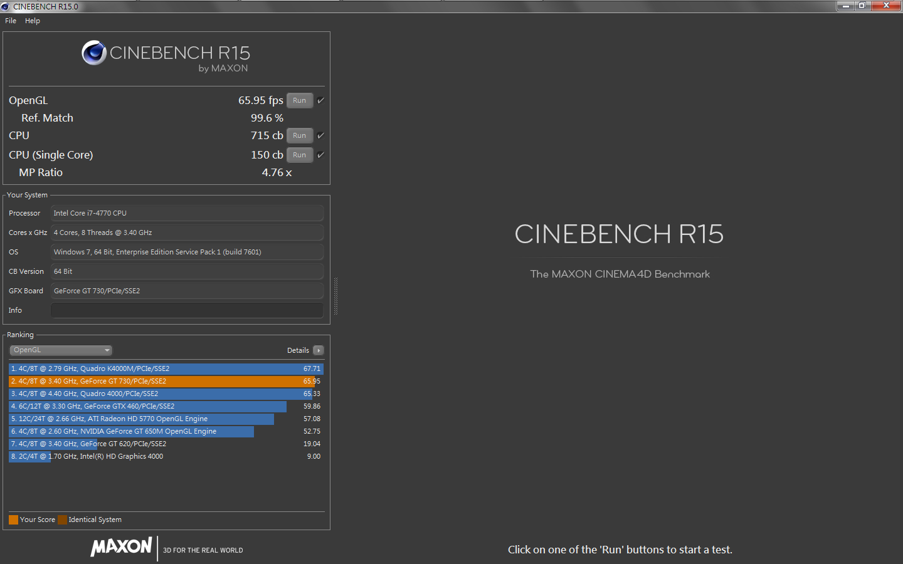

# 關於性能損失

據說Ryzen配上Nvidia的顯卡，性能損失約50%，配上AMD的顯卡，大約10%

那我們就來實測一下

**全部預設，沒有超頻**

## Ryzen 7 1700 + GTX 1050

### Windows

### macOS

## Ryzen 7 1700 + RX460

### Windows

### macOS

## 同場加映

### i7 4770 + GT730 \(8G RAM / 學校電腦\)

