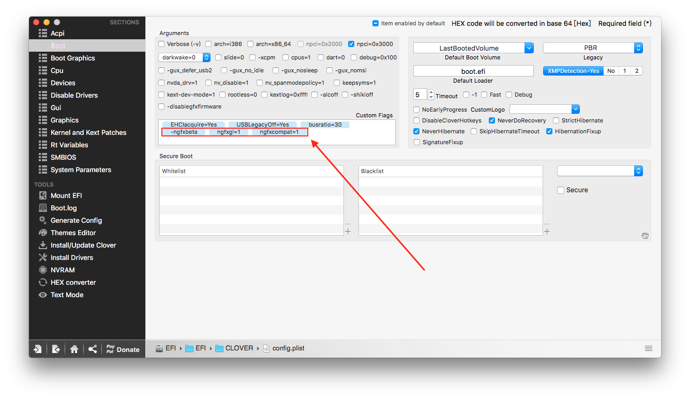

# VRAM使用率超高

裝了iStat Menus後，有觀察到剛開機時顯卡記憶體使用率超高，導致畫面Lag，可是在睡眠喚醒後，使用率會降低到一半以下

不過加了一個Kext和一些Flags後，這事就解決了

## 加Kexts

不意外的，就是[NvidiaGraphicsFixUp](https://github.com/lvs1974/NvidiaGraphicsFixup/releases)


下載：[https://github.com/lvs1974/NvidiaGraphicsFixup/releases](https://github.com/lvs1974/NvidiaGraphicsFixup/releases)


安裝很簡單，就丟進 EFI/EFI/CLOVER/kexts/10.12

## Boot Flags

然後開啟Clover Configurator，並在Boot頁面中的Custom Flags加入

`-ngfxbeta`

`-ngfxgl=1`

`-ngfxcompat=1`

## 後記

作者提供的Flags很多，我也試了很多，總之這樣搞之後VRAM使用率就下降了，目前使用上也沒什麼問題

