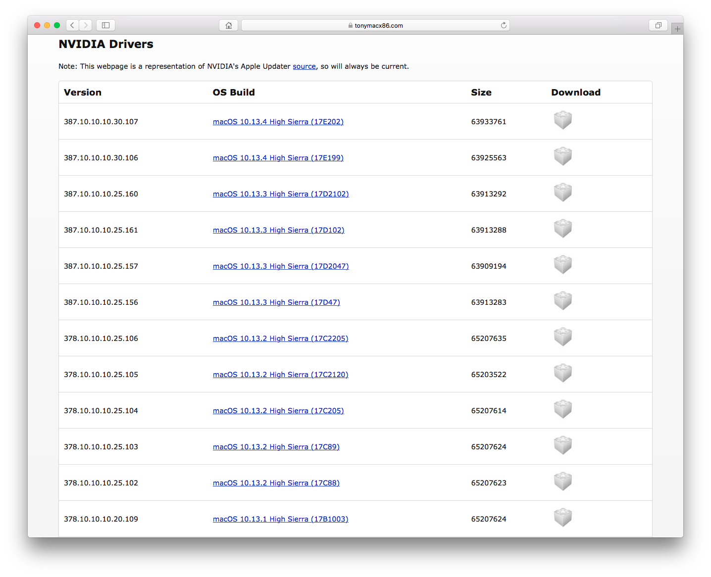
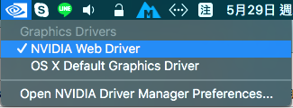

# 顯示


Nvidia Web Driver 下載：[https://www.tonymacx86.com/nvidia-drivers/](https://www.tonymacx86.com/nvidia-drivers/)


## 安裝教學

### 找到版本並下載

從Os Build中的後綴號碼找到適合你系統的驅動並下載

例如筆者的是 macOS 10.12.6 Sierra **\(16G29\)**，就找到對應的版本下載

### 安裝

毫無技術性，打開輸入密碼下一步案到底即可

### 啟用獨顯

正常來說應該會自己切換過去，如果沒有，記得切換過去

### 如何確認獨顯已啟用？

打開「關於這台Mac」，顯示卡部分有正常列出型號及記憶體大小就表示啟用了！

勾了 重開機了 獨顯還是沒有接管嗎？

那就改Clover設定吧！

## 疑難排解

### 獨顯無法啟用？

