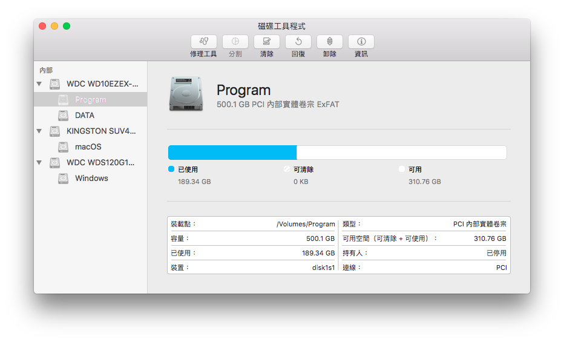
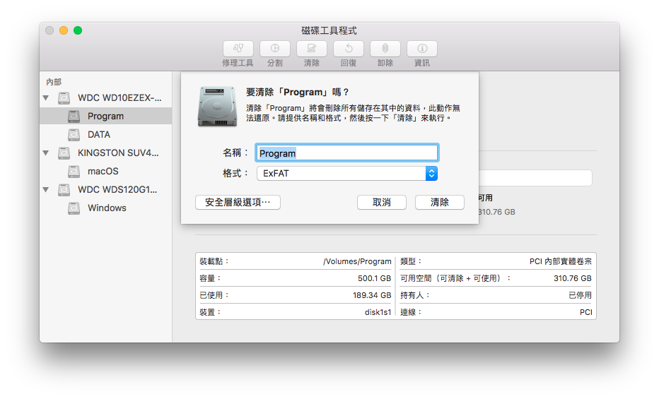

# 關於磁區分割

這是我的磁區分割現況

Kingston UV400 供 macOS使用 / HFS+

WD Green 120G 供 Windows 使用 / NTFS

WD Blue 1TB \(7200RPM\) 供儲存資料使用 / 分割為 exFAT + NTFS

## exFAT + NTFS有什麼好處？

這樣一來，exFAT的磁區就能在雙系統中存取了，不然macOS不支援NTFS，完全不能寫入

## 如何分割？


分隔前請備份好資料！


於macOS中打開磁碟工具程式

選擇你要的磁區，並按下清除

格式選擇**ExFAT**

