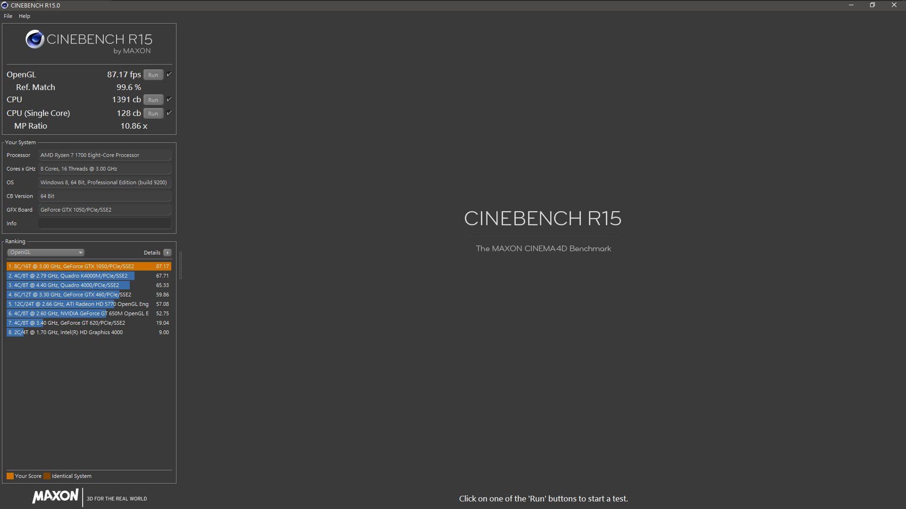
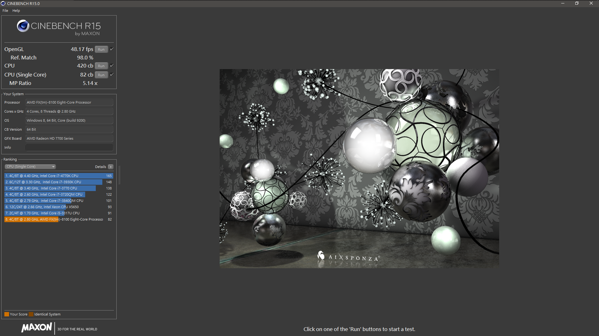

# 關於性能損失

目前爬文結果表示，Ryzen配上Nvidia的顯卡，性能損失約50%，配上AMD的顯卡，大約10%

筆者使用Ryzen + 1050，像是Mission Control之類的都會小Lag

筆者朋友使用Intel + 660，順暢無誤

所以如果可以，上A卡吧，只要放個WhateverGreen跟加入bootflag就可正常

總之我們就來實測一下，**全部預設，沒有超頻**

## Ryzen 7 1700 + GTX 1050

### Windows

可以看到正常效能應該落在**87fps**附近

> R15辨識有問題，變成Windows 8了

### macOS

可是同樣配備到了macOS卻剩下43fps

## Ryzen 7 1700 + RX460

### Windows

待測試

### macOS

待測試

## 同場加映

### Windows - i7 4770 + GT730 \(8G RAM / 學校電腦\)

就連GT730這張卡都有65fps啊啊啊啊

### Windows - AMD FX-8100 + HD7730 \(8G RAM / 路邊撿到的電腦\)

