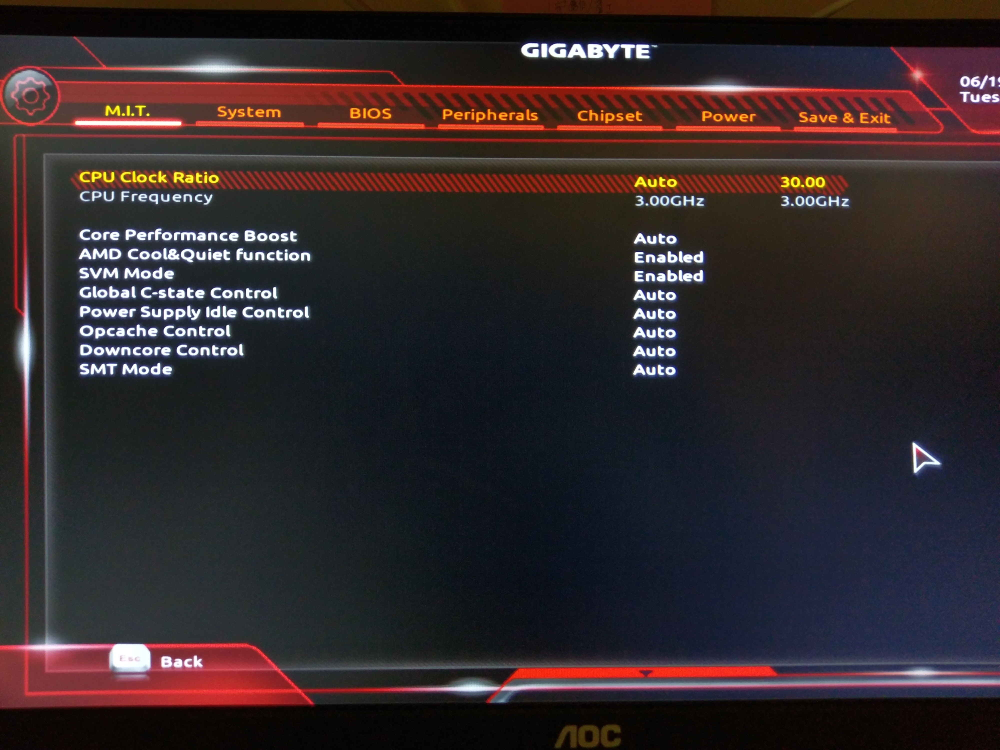
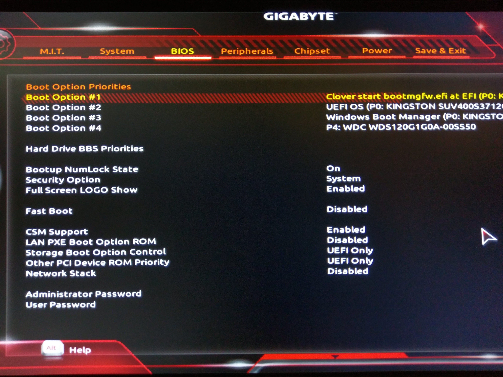
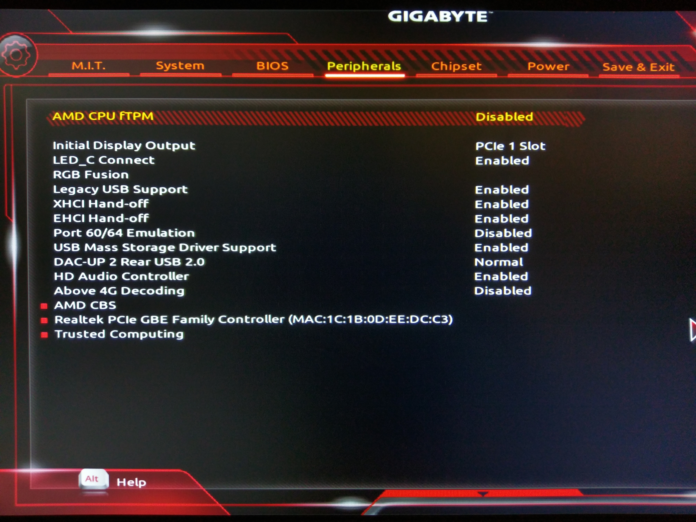
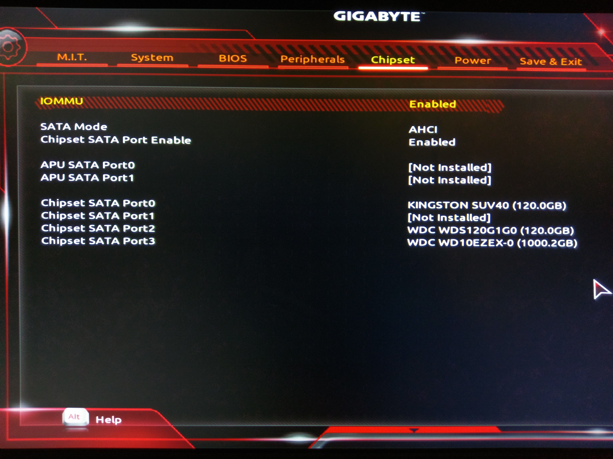
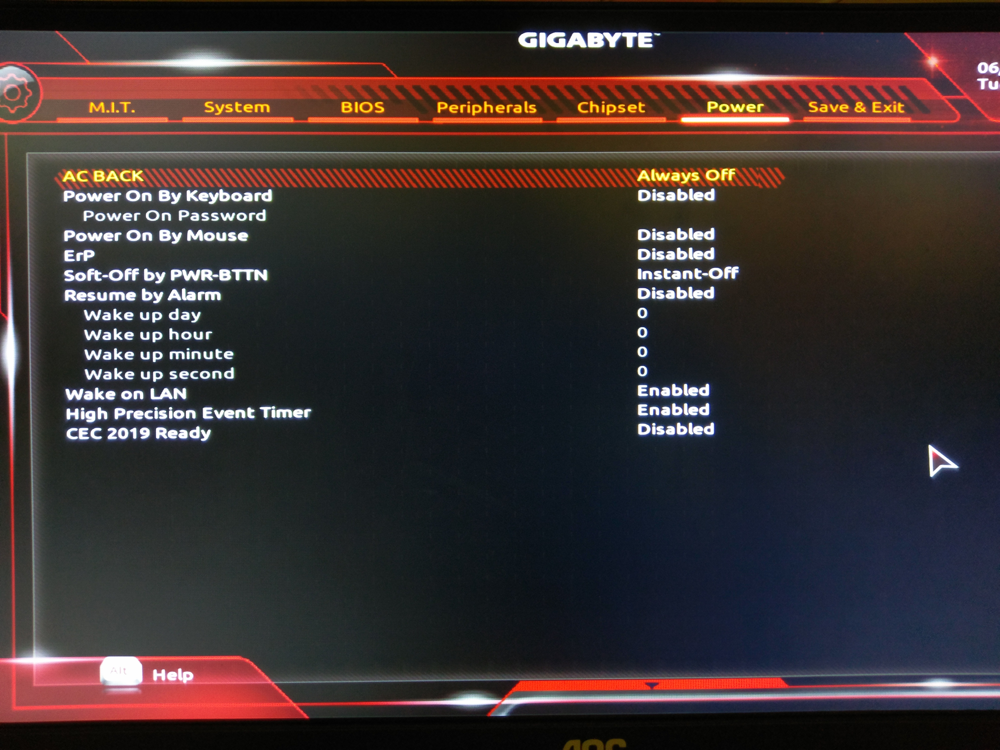

# Bios設定


[https://forum.amd-osx.com/viewtopic.php?f=24&t=2707](https://forum.amd-osx.com/viewtopic.php?f=24&t=2707)


恭喜你剛剛製作了你的第一支Sierra安裝隨身碟!

接著讓我們重開機並進入Bios開始設定吧

## 開機順序


強烈建議安裝時拔掉其他硬碟，只留下要安裝macOS的目標


將開機順位改為隨身碟第一

/待補圖

## 詳細設定 （以下內容僅供參考，設定以實際情況為主）

BIOS設定上若有問題請視情況調整，我有一些設定與別人的教學不一樣，而且全程沒動過設定

這邊使用的是**AB350 - Gaming 3**，所以截圖內容都以此主機板為主

BIOS版本：**`F20`**

### M.I.T.

位於 **Advanced Frequency Settings** &gt; **Advanced CPU Core settings**

AMD ****Cool&Quiet **`Enabled`**

SVM Mode **`Enabled`**

### BIOS

CSM Support **`Enabled`**

Storage Boot Option Control **`UEFI Only`**

Other PCI Device ROM Priority **`UEFI Only`**

PS:開機順位在這邊改，使用鍵盤上的「 + - 」符號進行設定

### Peripherals

Legacy USB Support **`Enabled`**

XHCI Hand-off **`Enabled`**

EHCI Hand-off **`Enabled`**

### Chipset

IOMMU **`Enabled`**

### Power

